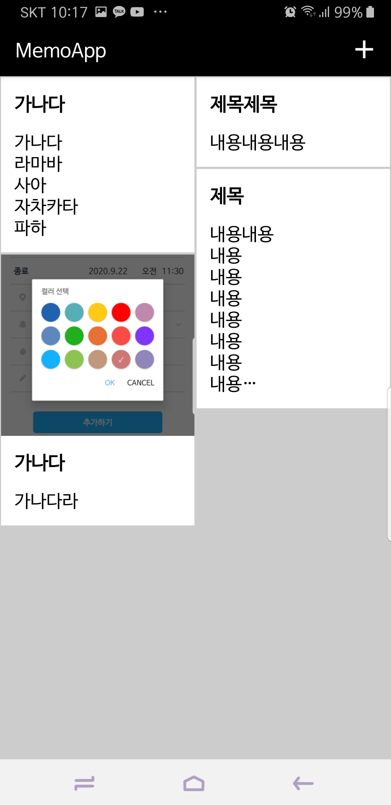
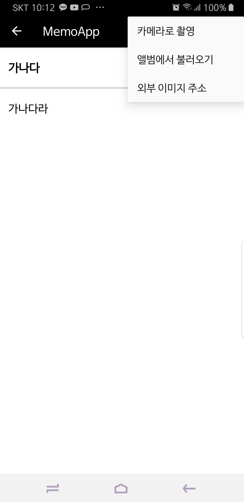
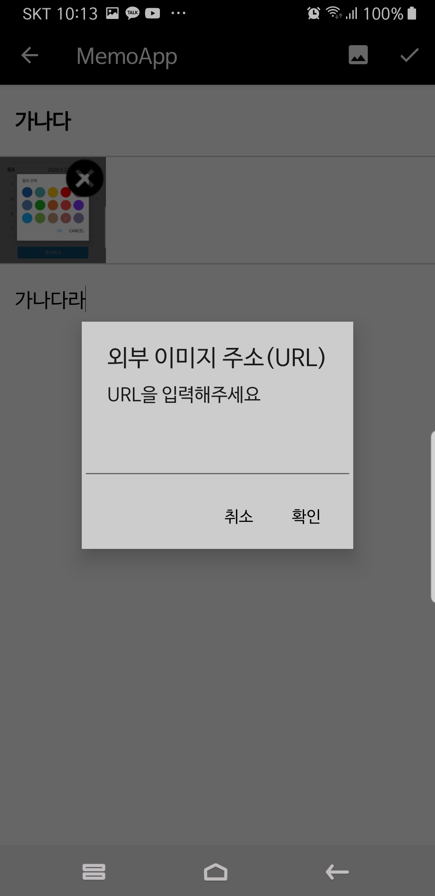
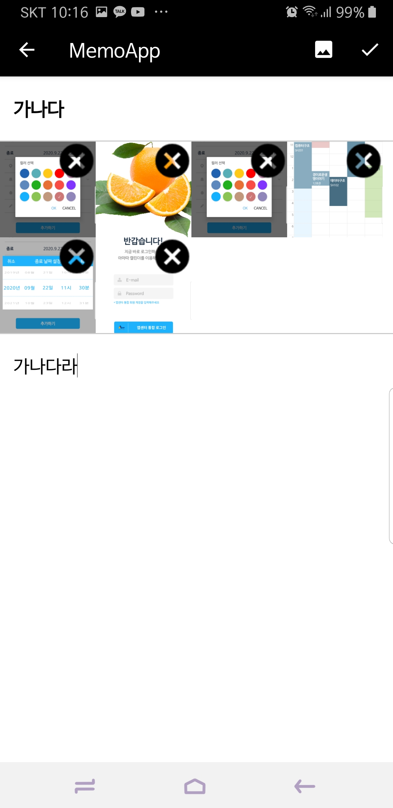
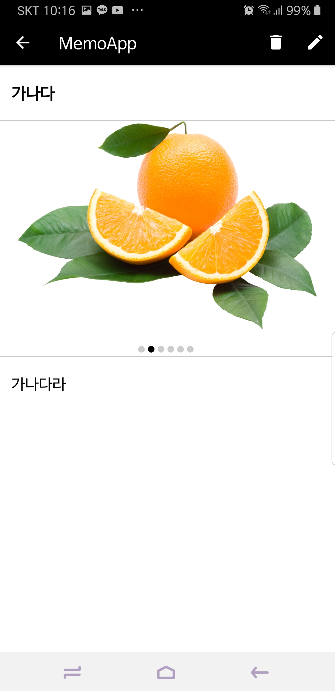

# ImageMemoApplication
카메라나 앨범 혹은 URL로 다수의 이미지 첨부가 가능한 메모장 앱

## Library
- Room
    - 로컬 데이터베이스로 메모 저장
- Gson
    - Room 테이블에 List를 저장하기 위해 TypeConverter에서 사용
- FlexboxLayout
    - 이미지 첨부 RecyclerView의 LayoutManager
- Glide
    - URL로 이미지 로딩
- [Album](https://github.com/yanzhenjie/Album)
    - 카메라 촬영 및 앨범 이미지 첨부 가능한 라이브러리
    - 이미지 File의 path를 지원하여 편리함

## To Do
- [ ] DetailActivity 스크롤 추가
- [ ] 이미지 없을 경우 빈 칸 제거
- [ ] RecyclerView.Adapter context
- [ ] AsyncTask에서 다른 방법으로 변경
- [ ] LiveData 올바르게 활용하기

### Refactoring
- [ ] 역할별 클래스 분리
- [ ] Data Binding
- [ ] Kotlin
- [ ] Coroutines
- [ ] MVVM
- [ ] ReactiveX